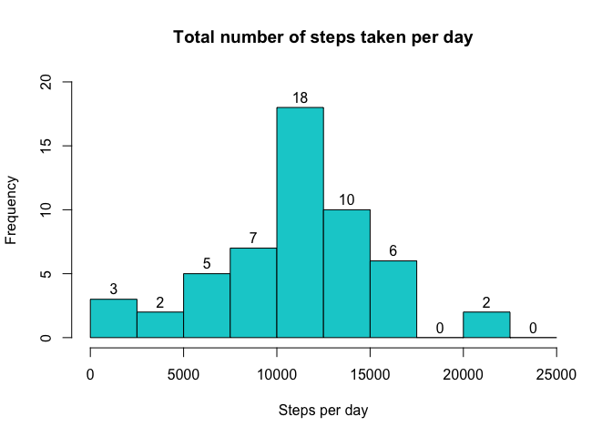
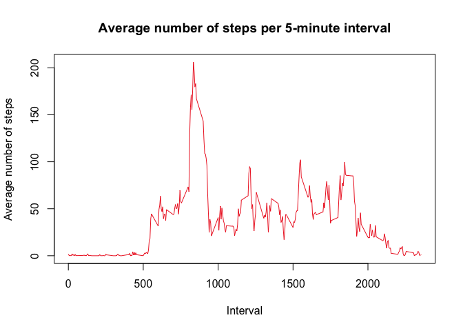
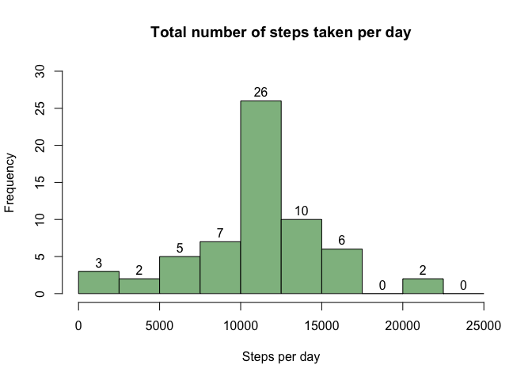
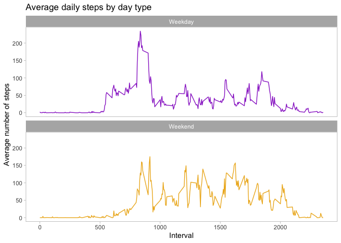

# Introduction

Introduction

It is now possible to collect a large amount of data about personal movement using activity monitoring devices such as a Fitbit, Nike Fuelband, or Jawbone Up. These type of devices are part of the “quantified self” movement – a group of enthusiasts who take measurements about themselves regularly to improve their health, to find patterns in their behavior, or because they are tech geeks. But these data remain under-utilized both because the raw data are hard to obtain and there is a lack of statistical methods and software for processing and interpreting the data.

This assignment makes use of data from a personal activity monitoring device. This device collects data at 5 minute intervals through out the day. The data consists of two months of data from an anonymous individual collected during the months of October and November, 2012 and include the number of steps taken in 5 minute intervals each day.

# Assignment
This assignment will be described in multiple parts. You will need to write a report that answers the questions detailed below. Ultimately, you will need to complete the entire assignment in a single R markdown document that can be processed by knitr and be transformed into an HTML file.

Throughout your report make sure you always include the code that you used to generate the output you present. When writing code chunks in the R markdown document, always use 
echo = TRUE
echo = TRUE so that someone else will be able to read the code. This assignment will be evaluated via peer assessment so it is essential that your peer evaluators be able to review the code for your analysis.

For the plotting aspects of this assignment, feel free to use any plotting system in R (i.e., base, lattice, ggplot2)

Fork/clone the GitHub repository created for this assignment. You will submit this assignment by pushing your completed files into your forked repository on GitHub. The assignment submission will consist of the URL to your GitHub repository and the SHA-1 commit ID for your repository state.

Questions:

* What is mean total number of steps taken per day?

* What is the average daily activity pattern?

* Imputing missing values

* Are there differences in activity patterns between weekdays and weekends?


Setting global options for making code visible in the finished file.

```r
knitr::opts_chunk$set(echo = TRUE)
```

## Loading and preprocessing the data

Loading data and setting classes of the columns.

```r
unzip("activity.zip")
activity <- read.csv("activity.csv", colClasses = c("numeric", "Date", "numeric"))
```

Exploring the basics of the data.

```r
str(activity)
```

```
## 'data.frame':	17568 obs. of  3 variables:
##  $ steps   : num  NA NA NA NA NA NA NA NA NA NA ...
##  $ date    : Date, format: "2012-10-01" "2012-10-01" ...
##  $ interval: num  0 5 10 15 20 25 30 35 40 45 ...
```

```r
dim(activity)
```

```
## [1] 17568     3
```

```r
summary(activity)
```

```
##      steps             date               interval     
##  Min.   :  0.00   Min.   :2012-10-01   Min.   :   0.0  
##  1st Qu.:  0.00   1st Qu.:2012-10-16   1st Qu.: 588.8  
##  Median :  0.00   Median :2012-10-31   Median :1177.5  
##  Mean   : 37.38   Mean   :2012-10-31   Mean   :1177.5  
##  3rd Qu.: 12.00   3rd Qu.:2012-11-15   3rd Qu.:1766.2  
##  Max.   :806.00   Max.   :2012-11-30   Max.   :2355.0  
##  NA's   :2304
```

## What is mean total number of steps taken per day?

Calculating the total number of steps taken per day (excluding missing data).

```r
total_steps_per_day <- aggregate(steps ~ date, activity, sum, na.rm = TRUE)
```

Creating a histogram of total steps per day frequency.

```r
with(total_steps_per_day, 
     hist(steps, breaks = seq(0, 25000, by = 2500), col = "darkturquoise",
     xlab = "Steps per day", ylim = c(0, 20), labels = TRUE, 
     main = "Total number of steps taken per day"))
```

<!-- -->

Calculating the mean and the median of steps per day.

```r
mean_total_steps_per_day <- round(mean(total_steps_per_day$steps))
median_total_steps_per_day <-median(total_steps_per_day$steps)
```

Therefore, the mean value of total steps per day is **10766**, and the median value is **10765**.

*To show mean and median value in the text correctly we need to use "r toString(mean_total_steps_per_day)" and "r toString(median_total_steps_per_day)".*

## What is the average daily activity pattern?
Calculating the mean vulue of steps for each interval (excluding missing data).

```r
average_daily_steps <- aggregate(steps ~ interval, activity, mean, na.rm = TRUE)
```

Creating a time series plot of the 5-minute interval and the average number of steps taken.

```r
with(average_daily_steps, 
     plot(interval, steps, type = "l", col = "firebrick2",
     ylab = "Average number of steps", xlab ="Interval",
     main = "Average number of steps per 5-minute interval"))
```

<!-- -->

Finding the 5-minute interval, which contains the maximum number of steps.

```r
max_interval <- average_daily_steps[which.max(average_daily_steps$steps), ]$interval
```

Therefore, the interval, containing the maximum number of steps, is **835**.

## Imputing missing values
Calculating the total number of missing values in the dataset.

```r
na_num <- sum(is.na(activity$steps))
```

So we have **2304** rows with missing values.

Missing values will be fulfilled by mean values from the previous step. The result will be saved to the new dataset.

```r
activity_impute <- activity
activity_impute$steps <- ifelse(is.na(activity_impute$steps),
                                round(average_daily_steps$steps[match(activity_impute$interval,
                                average_daily_steps$interval)],0), activity_impute$steps)
```


Calculating the total number of steps taken per day (excluding missing data).

```r
total_steps_per_day_new <- aggregate(steps ~ date, activity_impute, sum, na.rm = TRUE)
```

Creating a histogram of total steps per day frequency.

```r
with(total_steps_per_day_new, 
     hist(steps, breaks = seq(0, 25000, by = 2500), col = "darkseagreen",
     xlab = "Steps per day", ylim = c(0, 30), labels = TRUE, 
     main = "Total number of steps taken per day"))
```

<!-- -->

Culculating the mean and the median of steps per day in the imputed data.

```r
mean_total_steps_per_day_new <- round(mean(total_steps_per_day_new$steps))
median_total_steps_per_day_new <-median(total_steps_per_day_new$steps)
```

Therefore, the mean value of total steps per day is **10766**, and the median value is **10762**. 

As we can see, the mean and median almost haven't changed.

## Are there differences in activity patterns between weekdays and weekends?

Adding the weekdays variable.

```r
activity$weekday <- weekdays(activity$date)
```

Adding the type of the weekday.

```r
activity$day_type <- sapply(activity$date, function(x) {
        if(weekdays(x) == "Saturday" | weekdays(x) == "Sunday")
        {y <- "Weekend"} else 
        {y <- "Weekday"}
        y
}) 
```

Calculating the mean value of steps per interval and type of the day.

```r
steps_per_day_type <- aggregate(steps ~ interval + day_type, activity, mean, na.rm = TRUE)
```

Plotting the average number of steps per interval divided by day type.

```r
library(ggplot2)
ggplot(steps_per_day_type, aes(interval, steps, color = day_type)) +
        facet_wrap(~day_type, ncol = 1, nrow=2) + 
        geom_line() +
        theme_light() +
        theme(panel.grid.major = element_blank(), panel.grid.minor = element_blank(), legend.position = "none") +
        labs(x = "Interval", y = "Average number of steps", title = "Average daily steps by day type") +
        scale_color_manual(values = c("Weekday" = "darkorchid",
                                     "Weekend" = "goldenrod2"))
```

<!-- -->
